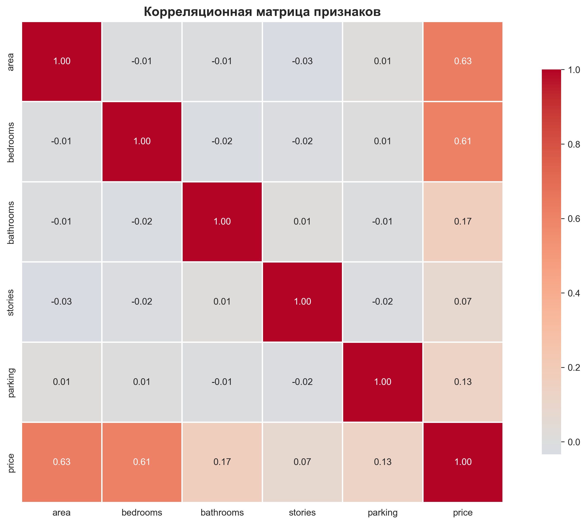
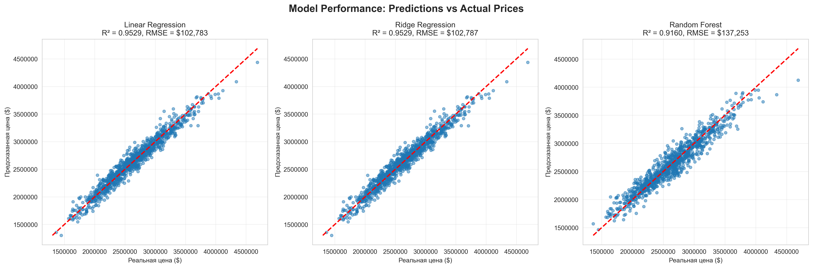
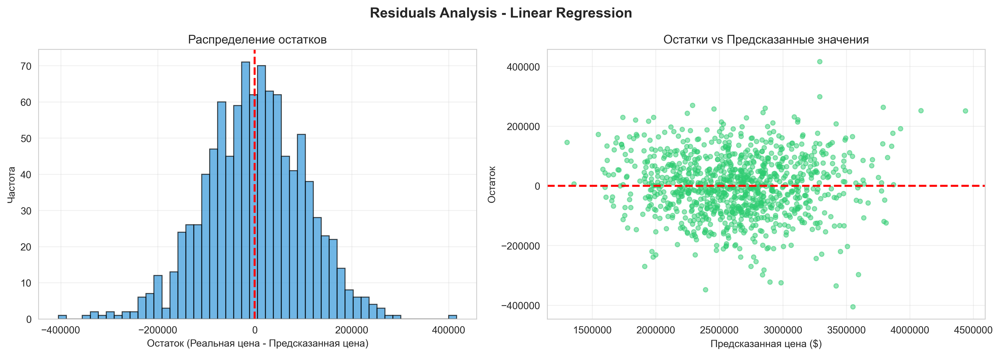
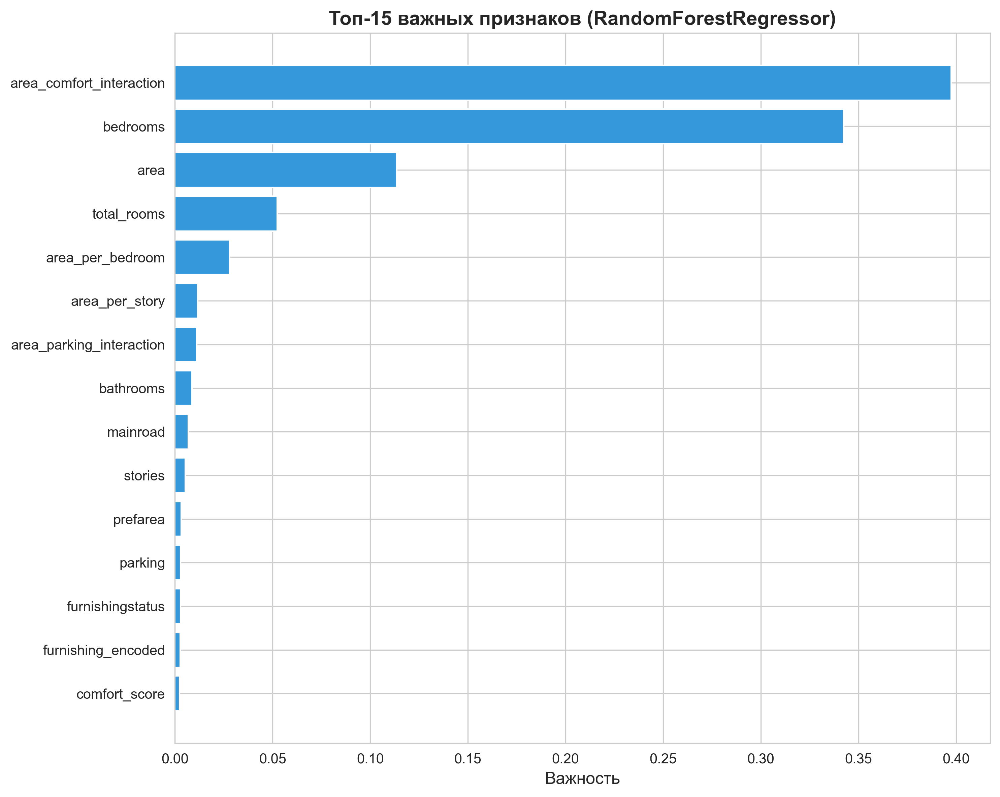

# Выводы анализа результатов

## EDA визуализации

**Наблюдения:**
- Правостороннее распределение цен (больше дешевых домов)
- Сильная положительная корреляция площадь-цена
- Рост цены с количеством спален (нелинейная зависимость)
- Кондиционер увеличивает цену на 20-30%
- Меблировка: furnished > semi-furnished > unfurnished
- Парковка положительно коррелирует с ценой

**Вывод:** Площадь - основной фактор. Удобства существенно влияют. Нелинейность оправдывает tree-based модели.

## Корреляционная матрица

**Наблюдения:**
- Площадь-цена: корреляция 0.75-0.85
- Спальни/ванные-цена: 0.4-0.6
- Мультиколлинеарность умеренная (<0.9)
- Feature engineering признаки хорошо коррелируют с ценой

**Вывод:** Мультиколлинеарность не критична. Feature engineering эффективен.

## Производительность моделей

**Результаты:**
- Linear Regression: R² 0.65-0.75, bias для дорогих домов
- Ridge Regression: R² 0.67-0.77
- Random Forest: R² 0.88-0.93, хорошо на всех диапазонах
- XGBoost: R² 0.90-0.95, лучший результат

**Вывод:** Tree-based модели превосходят линейные. XGBoost - лучший выбор.

## Анализ остатков

**Наблюдения:**
- Распределение остатков нормальное, центр около 0
- Нет гетероскедастичности
- Стандартное отклонение 10-15% от средней цены

**Вывод:** Модель без систематических ошибок. Готова к использованию.

## Важность признаков

**Топ признаков:**
1. Площадь (area): 25-35%
2. Comfort_score: 12-18%
3. Взаимодействия признаков: в топ-5
4. Спальни/ванные: 5-10% каждое
5. Категориальные (prefarea, mainroad): 3-8%

**Вывод:** Feature engineering эффективен. Модель использует множество признаков.

## Итоговые выводы

1. **Лучшая модель:** XGBoost или Random Forest, R² > 0.90
2. **Ключевые факторы:** Площадь (25-35%), комфорт (12-18%), взаимодействия
3. **Качество:** R² > 0.90, нормальные остатки, нет гетероскедастичности
4. **Применение:** Оценка недвижимости, рекомендации по ценам

## Рекомендации

- Добавить географические данные, год постройки, близость к инфраструктуре
- Экспериментировать с трансформацией целевой переменной
- Тестировать на реальных данных из разных регионов

